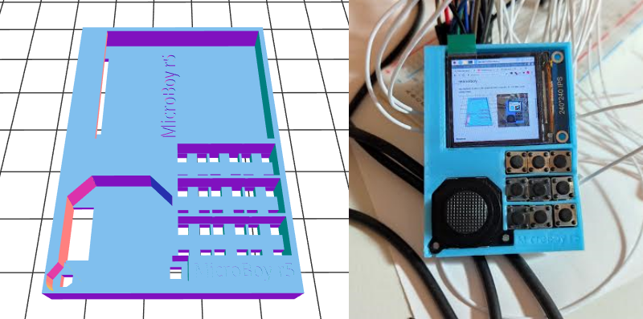

# microboy
My raspberry pi zero powered mini computer (3d print files, code, product lists)

 

### Parts
Joystick - Sparkfun COM-09426

Display - 1.3" 240x240 LCD TFT SPI Display (ST7789 Driver) no chip select pin (GND,VCC,SCL,SDA,RES,DC,BLK)

Analog to Digital converter - Adafruit ADS1015 12-bit I2C

Battery - LP603450 LiPoly 3.7V 1000mAh TG15

Battery Charge / Voltage regulator / Transformer board - Adafruit PowerBoost 500 Charger TPS61090 DC Boost (Not strong enough to power pi4 or CM4)

Small Dip Switch (unknown)

Raspberry Pi Zero W

 

### Wiring
<pre>
RPi BOARD Pin #1 (3.3V) -> Display VCC
       		        -> Joystick VCC (Pin 4)
                        -> ADS1015 VCC

RPi BOARD Pin #2 (5V)  -> PowerBoost 5V

RPi BOARD Pin #6 (GND) -> Display GND
                       -> Joystick GND (Pin 2)
		       -> ADS1015 GND
		       -> PowerBoost GND
                       -> Small Switch Right
                       -> Button 1 Right
                       -> Button 2 Right
                       -> Button 3 Right
                       -> Button 4 Right
                       -> Button 5 Right
                       -> Button 6 Right
                       -> Button 7 Right
                       -> Button 8 Right
                       -> Button 9 Right

RPi BOARD Pin #3 (SDA) -> ADS1015 SDA
RPi BOARD Pin #5 (SCL) -> ADS1015 SCL

RPi BOARD Pin #23 (SCLK) -> Display SCL
RPi BOARD Pin #19 (MOSI) -> Display SDA
RPi BOARD Pin #15 -> Display RES
RPi BOARD Pin #11 -> Display DC
Rpi BOARD Pin #13 -> Display BLK

RPi BOARD Pin #36 -> Button 1 Left
RPi BOARD Pin #22 -> Button 2 Left
RPi BOARD Pin #18 -> Button 3 Left
RPi BOARD Pin #16 -> Button 4 Left
RPi BOARD Pin #37 -> Button 5 Left
RPi BOARD Pin #29 -> Button 6 Left
RPi BOARD Pin #31 -> Button 7 Left
RPi BOARD Pin #40 (PCM_DOUT) -> Button 8 Left
RPi BOARD Pin #38 (PCM_DIN) -> Button 9 Left

ADS1015 A0 -> Joystick X/Y (Pin 1)
ADS1015 A1 -> Joystick X/Y (Pin 3)

PowerBoost EN -> Small Switch Left
</pre>
